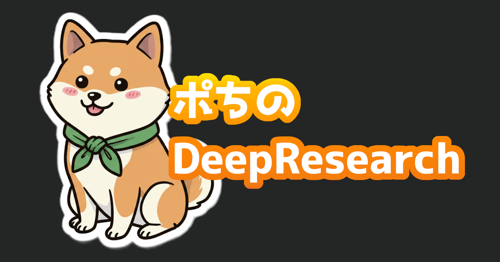

# ポちのDeepResearch



このリポジトリは、Google Geminiを使用したDeepResearchの結果を共有するためのGitHub Pagesサイトです。

## 構造

```text
.
├── _config.yml      # サイトの設定ファイル
├── _topics/         # 各トピックのMarkdownファイル
│   └── topic-name/  # トピックごとのフォルダ
│       ├── index.md      # トピックのメインコンテンツ
│       └── dashboard.html # トピックの補足資料（SPA等）
├── _layouts/        # HTMLレイアウトテンプレート
├── _includes/       # 再利用可能なHTMLコンポーネント
├── assets/          # 静的ファイル
│   ├── audio/      # 音声ファイル
│   ├── css/        # スタイルシート
│   └── images/     # 画像ファイル
└── index.md        # メインページ
```

## 新しいトピックの追加方法

1. `_topics` フォルダに新しいフォルダを作成します（例：`my-research`）
1. そのフォルダ内に `index.md` を作成し、以下のようなFront Matterを追加します：

```yaml
---
layout: topic
title: "トピックのタイトル"
date: YYYY-MM-DD
category: "ai"  # "ai", "research", "code", "tutorial" のいずれかを指定
tags: [タグ1, タグ2]
audio: "/share-deepresearch/assets/audio/your-audio-file.mp3"  # 音声ファイル（オプション）
supplementary_materials:  # 補足資料（オプション）
  - title: "補足資料のタイトル"
    url: "/share-deepresearch/topics/your-topic/dashboard.html"
---
```

1. Markdownで内容を記述します
1. 必要に応じて、補足資料用のHTMLファイル（`dashboard.html`等）を作成します
1. 音声ファイルがある場合は、`assets/audio/` フォルダに配置します

## ドキュメント作成のワークフロー

DeepResearchの結果をドキュメント化する際の推奨手順は以下の通りです：

1. DeepResearchの結果をGoogleドキュメントにエクスポートします
2. Googleドキュメントから「ダウンロード」→「Markdownとして保存(.md)」を選択し、ダウンロードします
3. ダウンロードしたMarkdownファイルを`_topics/[トピック名]/index.md`として配置します
4. Geminiで作成した音声概要をmp3形式でダウンロードし、`assets/audio/`フォルダに配置します
5. 補足資料が必要な場合は、DeepResearchのレポート右上にある「作成」ボタンからダッシュボードなどを作成し、HTMLとしてエクスポートします
6. エクスポートしたHTMLファイルを`_topics/[トピック名]/dashboard.html`として配置します

このワークフローに従うことで、一貫性のあるドキュメント構造を維持できます。

## プロンプトメモ

- 資料を基にインフォグラフィックなデザインのWebサイトを作成したい。\
スマートフォンでも見れるデザインを前提として、JavaScriptのSPAを作成する。\
文量としては1000行程度のHTMLを想定している。
- スマートフォンを前提としたデザインで、○○を触って覚えるJavaScriptのSPAアプリ
- Reveal.jsを用いたインフォグラフィックなプレゼン資料、文字がスライドをはみ出さないよう留意する。

## ローカルでの開発

1. Rubyをインストール
1. 必要なgemをインストール：

```bash
gem install bundler
bundle install
```

1. ローカルサーバーを起動：

```bash
bundle exec jekyll serve --config _config_dev.yml
```

## ライセンス

このプロジェクトはMITライセンスの下で公開されています。
